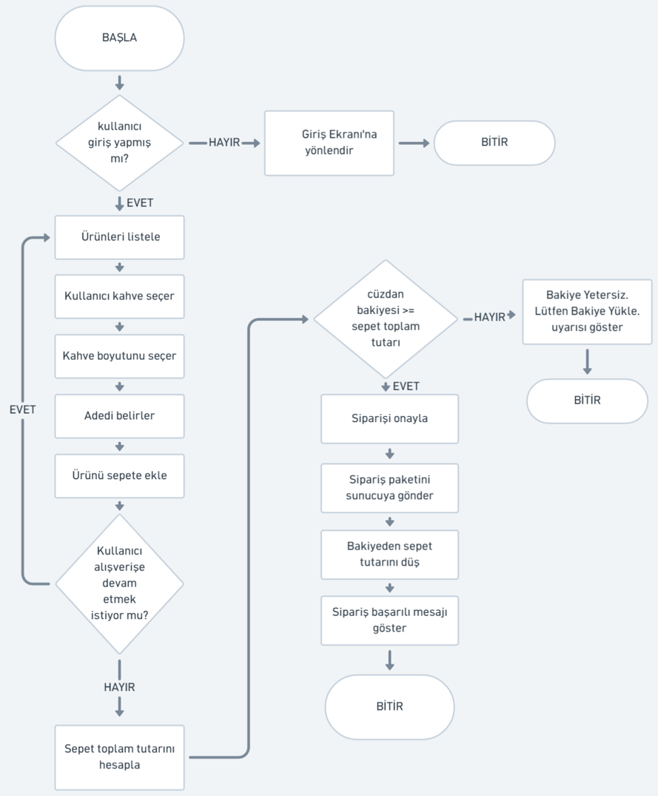

# KahveGo Mobil Sipariş Uygulaması

---

**GÖREV 1: Mobil Akış Şeması (Flowchart) veya Sözde Kod (25 Puan)**

**A)**



**B)**

```text
BAŞLA

EĞER kullanıcı giriş yapmış mı?

    HAYIR İSE
        Giriş Ekranı'na yönlendir
    BİTİR

    EVET İSE
        Ürünleri listele

        DÖNGÜ
            Kullanıcı kahve seçer
            Kahve boyutunu seçer
            Adedi belirler
            Ürünü sepete ekle

            EĞER kullanıcı alışverişe devam etmek istiyor mu?
                EVET İSE
                    Ürün seçmeye devam et
                DEĞİLSE
                    Döngüden çık
            BİTİR
        DÖNGÜ SONU

        Sepet toplam tutarını hesapla

        EĞER cüzdan bakiyesi >= sepet toplam tutarı
            EVET İSE
                Siparişi onayla
                Sipariş paketini sunucuya gönder
                Bakiyeden sepet tutarını düş
                Sipariş başarılı mesajı göster
            DEĞİLSE
                "Bakiye Yetersiz. Lütfen Bakiye Yükle." uyarısı göster
            BİTİR

BİTİR
```

---

**GÖREV 2: REST API Uç Noktası (Endpoint) & JSON Tasarımı (25 Puan)**

**1. Sipariş Oluşturma Endpoint'i**

**HTTP Metodu:** `POST`

**URL / Endpoint:** `/api/v1/siparisler`

**Header:**

```text
Authorization: Bearer <token>
Content-Type: application/json
```

**Örnek Request Body (JSON):**

```json
{
  "urunler": [
    {
      "kahve_adi": "Frappe",
      "boyut": "Tall",
      "adet": 2,
      "birim_fiyat": 230.00
    }
  ],
  "toplam_tutar": 460.00
}
```

**Başarılı Sonuç HTTP Durum Kodu:** `201 Created`

**Kullanıcı Giriş Yapmamışsa Dönecek HTTP Durum Kodu:** `401 Unauthorized`

---

**2. Cüzdan Bakiye Sorgulama Endpoint'i**

**HTTP Metodu:** `GET`

**URL / Endpoint:** `/api/v1/kullanici/bakiye`

**Örnek Response (JSON):**

```json
{
  "kullanici_id": 1254,
  "bakiye": 185.50,
  "para_birimi": "TRY",
  "son_guncelleme": "2026-09-15T16:45:00"
}
```

**Sunucuda Beklenmeyen Hata Çıkarsa Dönecek Durum Kodu:** `500 Internal Server Error`

**Mini Mülakat Sorusu:**

Yukarıdaki `GET` ve `POST` isteklerinden hangisi Idempotent (Eşgüçlü) bir istektir, hangisi değildir? Neden?

**Cevap:** `GET` metodu idempotenttir çünkü aynı istek tekrarlandığında sunucudaki kaynak üzerinde değişiklik oluşturmaz; `POST` ise yeni bir sipariş oluşturabileceği için idempotent değildir.

---

**GÖREV 3: Clean Code & SOLID Prensip Teşhisi (25 Puan)**

**1. SRP (Single Responsibility Principle - Tek Sorumluluk Prensibi)**

KahveSiparisYoneticisi sınıfı sepet hesaplama, kredi kartından ödeme alma, veritabanına kayıt ve SMS gönderme gibi birden fazla sorumluluğu aynı anda üstlendiği için SRP'yi ihlal etmektedir. Bu sınıf; `SepetHesaplayici`, `IndirimServisi`, `OdemeServisi`, `SiparisRepository` ve `BildirimServisi` gibi ayrı sınıflara bölünmelidir.

**2. OCP (Open/Closed Principle)**

`indirimHesapla` fonksiyonuna yeni bir müşteri tipi eklendiğinde mevcut `if-else` yapısını değiştirmek gerektiği için **Ope**
